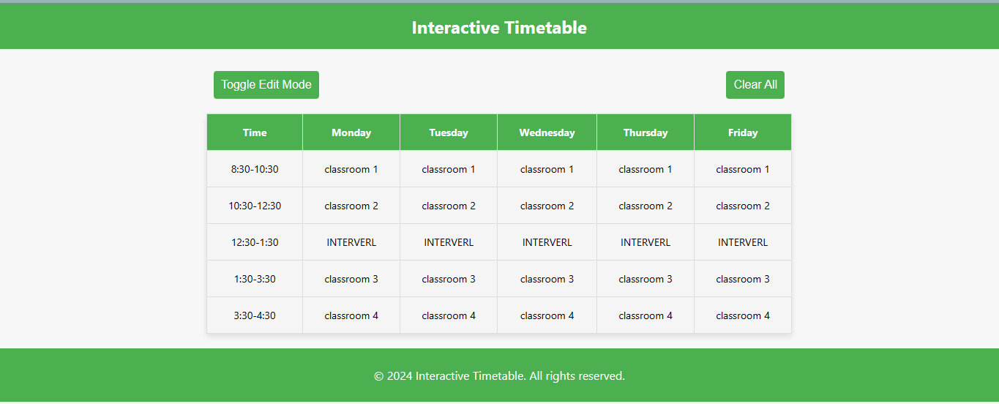
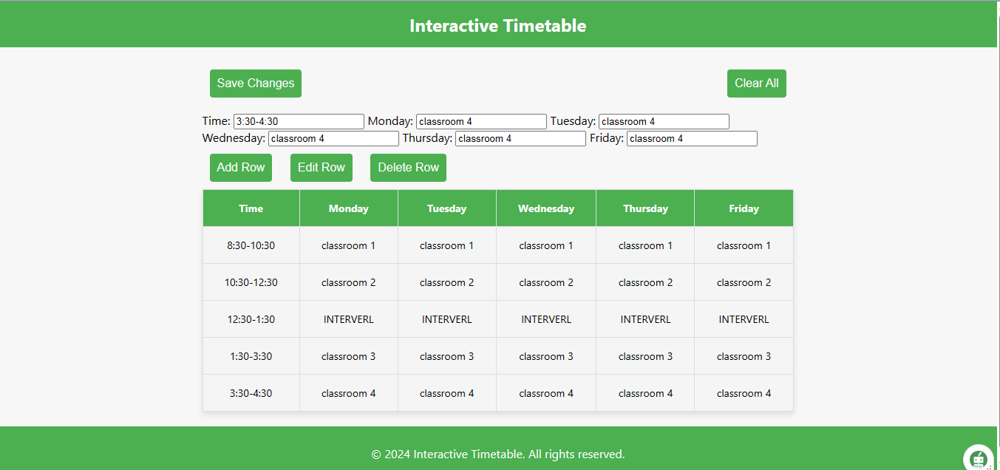

# Interactive Timetable

Welcome to the Interactive Timetable project! This web application allows you to create and manage a weekly timetable with ease. You can add, edit, and delete classes for each day of the week.




## Table of Contents
- [Features](#features)
- [Demo](#demo)
- [Getting Started](#getting-started)
  - [Prerequisites](#prerequisites)
  - [Installation](#installation)
- [Usage](#usage)
  - [Toggle Edit Mode](#toggle-edit-mode)
  - [Add Row](#add-row)
  - [Edit Row](#edit-row)
  - [Delete Row](#delete-row)
  - [Clear All](#clear-all)
- [Customization](#customization)
- [Contributing](#contributing)
- [License](#license)

## Features

- Interactive and user-friendly interface.
- Edit and delete classes easily.
- Save timetable data locally for future reference.
- Responsive design for various screen sizes.

## Demo
Check out the [live demo]() to play the game.

## Getting Started

### Prerequisites

Make sure you have the following installed on your machine:

- Web browser (Google Chrome, Firefox, Safari, etc.)

### Installation

1. Clone the repository to your local machine:

    ```bash
    git clone https://github.com/gmpsankalpa/interactive-timetable.git

2. Open the `index.html` file in your preferred web browser.

## Usage

### Toggle Edit Mode
Click the "Toggle Edit Mode" button to switch between viewing the timetable and editing mode. In edit mode, you can add, edit, and delete classes.

### Add Row
1. In edit mode, fill in the "Time" and class information for each day of the week.
2. Click the "Add Row" button to add the class to the timetable.

### Edit Row
1. In edit mode, click on the row you want to edit. The row will be highlighted.
2. Modify the class information in the form.
3. Click the "Edit Row" button to save the changes.

### Delete Row
1. In edit mode, click on the row you want to delete. The row will be highlighted.
2. Click the "Delete Row" button to remove the selected class.

### Clear All
Click the "Clear All" button to remove all classes from the timetable.

## Customization
Feel free to customize the styles and layout by modifying the HTML, CSS, and JavaScript files. Add your own colors, fonts, or additional features to suit your preferences.

## Contributing
Contributions are welcome! If you have suggestions, bug reports, or want to add new features, please open an issue or create a pull request.

## License
This project is licensed under the [MIT](LICENSE) License.

---

<div align="center">

   
   
   
   

</div>